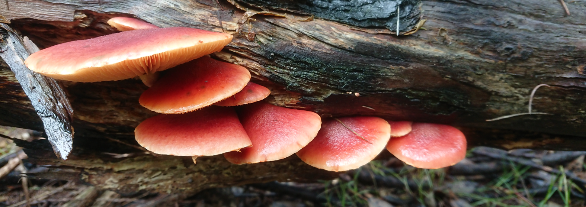
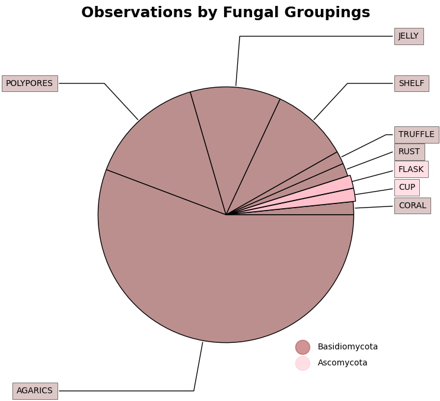
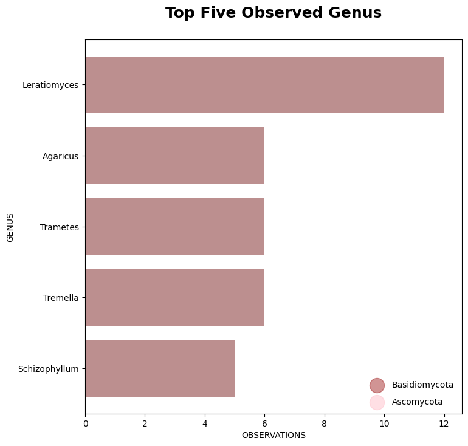
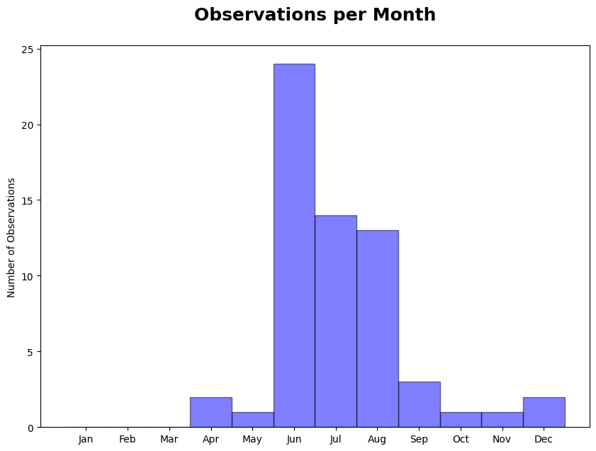
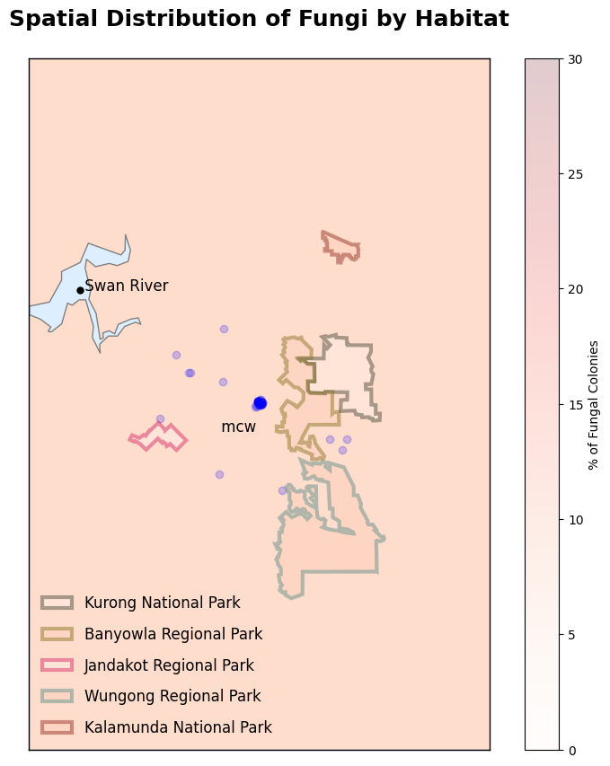
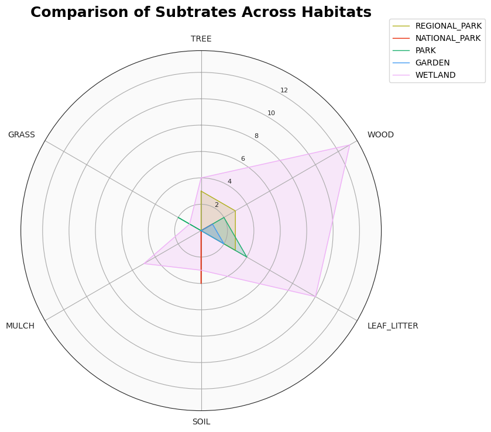

# LIVING TOGETHER: Plants wouldn't be as successful without the involvement of fungi. (Analysis with Python)

<figure>
    <center>
    
    <center>
</figure>

## About 400 million years ago, the two largest fungal phyla, Ascomycota and Basidiomycota appeared and helped plants colonise the earth. Both will form an intimate cooperation with living and dead plants making them critical partners in a healthy ecosystem. 

Today walking through an urban wetland after a burst of autumn rain, you may see a mushroom cap protuding beside the path throwing its spores into the wind. Seeking a new life style these spores will stick to you, an insect or plant while others travel in the air. Most of the fungi from the Ascos and Basidios phyla will be adaptable intermingling in their new community and helping out with food and water, while others can be nasty and aggressive.

I'm fascinated with the array of different fruiting bodies given its transient nature and surprised to discover that fungi is everywhere! With basic understanding of the two main groups but limited knowledge on their species taxa, the following comparisons are investigated: 

1. What are the typical features of fruiting bodies for the two largest phyla?
0. Which phylum is more prominent in South-East Perth region?
0. What are the fruiting times for the two phyla groups in the South-East Perth region?
0. What is the spatial distribution of the two group in the region?
0. What type of subtrate supports most diversity in fruiting bodies?

Reference:
- Keith Seifert. The Hidden Kingdom of Fungi. University of Queensland Press, 2022.
- Richard Robinson. Fungi of the South-West Forest. DBCA 2022.
- Bougher, N.L., Hart, R., Jayasekera, A., & Glossop, B. (2009). Bushland Fungi of Ellis Brook Valley Reserve. Perth Urban Bushland Fungi Project Report. URL: https://library.dbca.wa.gov.au/FullTextFiles/025304.pdf

For this project the data has been piped from two sources Biocollect and Eudoria. Maps and Charts can be generated in Jupyter notebook with appropriate python libraries.
```py
import pandas as pd
import numpy as np
import matplotlib.pyplot as plt
import datetime
import seaborn as sns
import statsmodels.api as sm

from mpl_toolkits.basemap import Basemap
from matplotlib.patches import Polygon
from perth_parks import BanyowlaRP, JandakotRP, KalamundaNP, KurongNP, WungongRP

# 1. LOAD AND PROFILE DATA
d = pd.read_json('data/mycota.json')
species = pd.DataFrame(d['mycota'][0]['species'])
records = pd.DataFrame(d['mycota'][0]['records'])

# 2. CLEAN AND EXPLORE DATA
def set_species(x):
    return species.loc[species['i'] == x]['n'].to_string(index=False)

def set_phyla(x):
    return species.loc[species['i'] == x]['p'].to_string(index=False)

records['date'] = pd.to_datetime(pd.to_datetime(records['d']*1000).dt.strftime('%d/%m/%Y'), format= '%d/%m/%Y')

# build new list of observations with formatted date and species.
observations = records[records['s'].isin(species['i'])]
observations['species'] = observations['s'].apply(set_species)

# format distinct categorical values to numerics values with factorize().
observations['habitat_no'], h_index = pd.Series(observations['h'].factorize())
observations['subtrate_no'], n_index = pd.Series(observations['n'].factorize())
observations['month'] = observations['date'].dt.month
observations['phyla'] = observations['s'].apply(set_phyla)
observations['phyla'], p_index = pd.Series(observations['phyla'].factorize())
observations['species'], s_index = pd.Series(observations['species'].factorize())

```

## What are the typical features of fruiting bodies for the two largest phyla?

The distinct difference between the two phyla groups is the way they produce spores. A visual approach is to use the appearance of their fruit body for classification. The following groups are used for convenience.

| Basidiomycota | Features |
| -----------   | ----------- |
| Agarcis       | Mushrooms with gills and cap. |
| Bolete        | Typical capped mushroom appearance with sponge-like pores on the underside.|
| Coral         | Coral-like appearance with delicate fleshy texture.  |
| Puffball      | Sac-like with unusal appearance. Sac will eventually rupture or split |
| Spine         | Usually be capped or coral-like but will have fleshy spines on the underside. |
| Truffle       | Generally spherical with a firm fleshy texture. Found below or on the surface in soil. |
| Shelf         | Thin, leathery, tiered structures usually found on wood. |
| Polypores     | Firm or hard bracket-like structures on trees and wood. |
| Jelly         | Soft gelatinous fungi on wood. |
| Rust          | Usually brown or yellow spots on plant also can be powdery rust coloured. |

| Ascomycota    | Features |
| -----------   | ----------- |
| Cup           | Having either cup, saucer or disc shaped fruit bodies. |
| Flask         | Most are hard, black charcoal-like fruit bodies. The sproes are flask shaped. |
| Morel         | A distinctive elongated honeycomb-like cap. |
| Tongues       | Firm and fleshy with tongue-like appearance. |

More than half of the fungi observed belong to the Agarics group. These basidios typically have caps and gills which allows an untrained eye to easily identify as a mushroom. Most fruit on the ground, sometimes hidden under leaf litter and could have a fragile ring around its stem.

<figure>
    <center>
    
    <figcaption>Pie chart showing the percentage of each phyla group.</figcaption>
    <center>
</figure>

```py
fig, ax = plt.subplots(figsize=(10, 7), subplot_kw=dict(aspect="equal"))

def set_clade(x):
    return species.loc[species['i'] == x]['c'].to_string(index=False)

observations['clade'] = observations['s'].apply(set_clade)
clade_count = observations.groupby(['clade','phyla']).size().reset_index(
        name='counts').sort_values(by = 'counts', ascending = True)

data = np.array(clade_count['counts'])
cLabels = np.array(clade_count['clade'])
cColors = np.array(clade_count['phyla'].apply(lambda x : 'pink' if x else 'rosybrown'))
cExplode = np.array(clade_count['phyla'].apply(lambda x : 0.02 if x else 0))

wedges, texts = ax.pie(data,
                       colors=cColors,
                       explode=cExplode, wedgeprops = {"edgecolor" : "black", 
                      'linewidth': 1, 
                      'antialiased': True})

for i, p in enumerate(wedges):
    
    bbox_props = dict(boxstyle="square,pad=0.5", fc=cColors[i], alpha=0.5, ec="k", lw=0.72)
    kw = dict(arrowprops=dict(arrowstyle="-"),
              bbox=bbox_props, zorder=0, va="center")

    ang = (p.theta2 - p.theta1)/2. + p.theta1
    y = np.sin(np.deg2rad(ang))
    x = np.cos(np.deg2rad(ang))
    horizontalalignment = {-1: "right", 1: "left"}[int(np.sign(x))]
    connectionstyle = f"angle,angleA=0,angleB={ang}"
    kw["arrowprops"].update({"connectionstyle": connectionstyle})
    ax.annotate(cLabels[i], xy=(x, y), xytext=(1.35*np.sign(x), 1.4*y),
                horizontalalignment=horizontalalignment, **kw)
    
# make legend with masked points.
for a in [0, 1]:
    plt.scatter([], [], c='pink' if a else 'brown', alpha=0.5, s=300, label='Ascomycota' if a else 'Basidiomycota')
ax.legend(scatterpoints=1, frameon=False, labelspacing=1, loc='lower right')

ax.set_title('Percentage of Fungal Groupings\n\n', fontweight = "bold", fontsize=18)
plt.show() 

```

## Which phylum is more prominent in the South-East Perth region?

The ascos may be the larger and more diverse of the two groups, I find them more elusive and harder to spot. Apparantly roughly 87,000 known ascos are microscopic and can only be seen as little dots or blobs. As a result the majority of fungi observed in the region belong to basidios. The basidios have larger fruiting structures and tend to arrange themselves in a concentrated area. 

The most prolific genus found in the area is Leratiomyces. They are usually spotted growing on wood chips in gardens.

<figure>
    <center>
    
    <figcaption>Bar chart comparing phyla based on most prolific genus.</figcaption>
    <center>
</figure>


```py
fig = plt.figure(figsize=(8,8))

def set_genus(x):
    return species.loc[species['i'] == x]['g'].to_string(index=False)


observations['genus'] = observations['s'].apply(set_genus)

genus_count = observations.groupby(['genus','phyla']).size().reset_index(
        name='counts').sort_values(by = 'counts', ascending = True)

genus_count_tot = genus_count.shape[0]

y = genus_count[genus_count['counts'] > 3 ]['genus']
x = genus_count[genus_count['counts'] > 3 ]['counts']
c = genus_count[genus_count['counts'] > 3 ]['phyla'].apply(lambda x : 'pink' if x else 'brown')

plt.barh(y, x, color=c)

# make legend with masked points.
for a in [0, 1]:
    plt.scatter([], [], c='pink' if a else 'brown', alpha=1, s=300, label='Ascomycota' if a else 'Basidiomycota')
plt.legend(scatterpoints=1, frameon=False, labelspacing=1)

plt.ylabel("GENUS")
plt.xlabel("OBSERVATIONS") 
plt.title('Prolific Genus from Observations\n', fontsize=14, fontweight="bold")

plt.show()
```

## What are the fruiting times for the two phyla groups in the South-East Perth region?

Most of the fungi fruiting occurs in June and July with the winter rains. Spores can fly off into the outdoor air and settle near by or far away on the ground. They can lie dormant waiting for the right temperature, amount of water or special signal. In urban areas given the right conditions fungi may fruit anytime of the year.

<figure>
    <center>
    
    <figcaption>Histogram showing monthly observations.</figcaption>
    <center>
</figure>

```py
months = list(observations['date'].dt.month)

fig, ax = plt.subplots(figsize=(10,7))
bins = np.arange(1,14)

ax.hist(months, bins = bins, edgecolor="k", color='b', alpha=0.5, align='left')
ax.set_xticks(bins[:-1])
ax.set_xticklabels([datetime.date(1900,i,1).strftime('%b') for i in bins[:-1]] )

# plt.xlabel('X-Axis')
plt.ylabel('Number of Observations')
plt.title('Histogram of Fungal Observations per Month\n', fontsize=18, fontweight="bold")
plt.show()
```

## What is the spatial distribution of the two group in the region?
The presence and abundance of different types of ascos and basidios in the region shows a strong relationship with 
genetically diverse tree populations. Urban parks and gardens are less complex, well designed ecosystems with ornamental plants,
wood chips and mulch holding their own symbionts and pathogens with potential to fruit any time of the year.

An urban wetland like Mary Carrol Park is an ideal habitat with its endemic paperbark and flooded gum trees, visiting 
and migratory birdlife and regular maintenance with native plants. An urban wetland will showcase the diverse talents 
of ascos and basidios as symbionts, decomposers and nutrient recyclers. The top five most prolific genus observed have
all come from the wetland and are are all basidios.

A variety of orchids can be located in Banyowla regional park. Orchids struggle to develop chlorophyll when young 
heavily depending on their fungi symbionts to grow. The jelly basidios will provide nutrition until photosynthesis 
develops. Annual burn-offs occur at some of the national and regional parks. Some species are stimulated by the burnt
ground like the polypore stonemaker, a basidios known to fruit shortly after a fire.

<figure>
    <center>
    
    <figcaption>Chlorepleth showing concentration of colonies and spatial distribution.</figcaption>
    <center>
</figure>

```py
locations = list(set(observations['l']))
fig = plt.figure(figsize=(10,10))

# 1. Draw the map background
width = 28000000; lon_0 = 116.001270; lat_0 = -32.081559

perth = Basemap(projection='lcc', lat_0=lat_0, lon_0=lon_0, width=40000, height=60000, resolution='h')
perth.drawcoastlines(color='gray')
perth.fillcontinents(color="#FFDDCC", lake_color='#DDEEFF')
perth.drawmapboundary(fill_color="#DDEEFF")

# 2. Map some points of interest.
x, y = perth(115.836665, -31.992744)
plt.plot(x, y, 'ok', markersize=5)
plt.text(x, y, ' Swan River', fontsize=12)
x, y = perth(115.962031, -32.102899)
plt.text(x, y, ' mcw', fontsize=12)

# 2. scatter urban faungal pupulations with fixed colour.
marks = observations[observations['l']=='URBAN']
lats = marks['x']
lons = marks['y']
perth.scatter(lons, lats, latlon=True, marker = 'o', c='b', zorder=1, alpha=0.2)

# 3. create habitat polygons applying colour bar for percentage.
max_perc = 30
plt.colorbar(label=r'% of Fungal Colonies')
plt.set_cmap('Reds')  # RdBu_r
plt.clim(0, max_perc)
cmap = plt.get_cmap()
colors = cmap(np.linspace(0, 1, max_perc))

korung = KurongNP(perth)
perKorung = (observations[observations['l'] == 'KORUNG'].count()['t'] / observations.count()['t'] * 100).astype(int)
polKorung = Polygon(korung.coordinates(), facecolor=colors[perKorung], edgecolor='#23291a',linewidth=3, alpha=0.4, label='Kurong National Park')
plt.gca().add_patch(polKorung)

banyowla = BanyowlaRP(perth)
perBanyowla = (observations[observations['l'] == 'BANYOWLA'].count()['t'] / observations.count()['t'] * 100).astype(int)
polBanyowla = Polygon(banyowla.coordinates(),facecolor=colors[perBanyowla],edgecolor='#726007',linewidth=3, alpha=0.4, label='Banyowla Regional Park')
plt.gca().add_patch(polBanyowla)

jandakot = JandakotRP(perth)
perJandakot = (observations[observations['l'] == 'JANDAKOT'].count()['t'] / observations.count()['t'] * 100).astype(int)
polJandakot = Polygon(jandakot.coordinates(),facecolor=colors[perJandakot],edgecolor='#ce034f',linewidth=3, alpha=0.4, label='Jandakot Regional Park')
plt.gca().add_patch(polJandakot)

wungong = WungongRP(perth)
perWungong = (observations[observations['l'] == 'WUNGONG'].count()['t'] / observations.count()['t'] * 100).astype(int)
polWungong = Polygon(wungong.coordinates(),facecolor=colors[perWungong],edgecolor='#408080',linewidth=3, alpha=0.4, label='Wungong Regional Park')
plt.gca().add_patch(polWungong)

kalamunda = KalamundaNP(perth)
perKalamunda = (observations[observations['l'] == 'KALAMUNDA'].count()['t'] / observations.count()['t'] * 100).astype(int)
polKalamunda = Polygon(kalamunda.coordinates(),facecolor=colors[perKalamunda],edgecolor='#7c0e04',linewidth=3, alpha=0.4, label='Kalamunda National Park')
plt.gca().add_patch(polKalamunda)

plt.legend(scatterpoints=1, frameon=False, labelspacing=1, loc='lower left', fontsize=12)
plt.title('Spatial Distribution of Fungi by Habitat\n',fontweight="bold", fontsize=18)
plt.show()

```

## What type of subtrate supports most diversity in fruiting bodies?
From the data collected so far, there is a vast difference in the fungal populations from the wetland. Mary Carrol Park which
serves as an urban wetland has also been burnt in some parts, Ascos are known to thrive on these conditions. The 
Eucalyptus-Melaleuca and burnt soil contain diverse ectomycorrhizal communities as some parts of the park there is 
a Gymnopilus, from the Agarics group fruiting on the paperbark tree itself. The wetland also has human influences being managed,
maintained and redeveloped for recreational activities. Wood chips is the typical mulch found at the wetland, parks and 
gardens in the urban areas, hence the large Leratiomyces populations from the Agarics group.

A strong cooperative relationship exists between plants and fungi, where fungi will exists inside plant leaves, stems and roots.
Most tree diseases are endemic and there is a lot of resiliency with it's defense system prepared to drop a leaf or branch if it
is infected. Once dropped, the fungi within will still consume and may of turned parasitic. The relationship between fungi
and tree changes with age and environmental conditions. A lot of the fuiting occurs on fallen branches or rotting wood, like the
jelly Tremella, polypore Trametes and shelf Schizophyllum. If fruiting is occuring on a living tree, it may be an indication 
that internal rot is occurring.

<figure>
    <center>
    
    <figcaption>Radar chart showing the relationship between subtrate and habitat.</figcaption>
    <center>
</figure>

## Some regression with habitat and subtrate. 

```
OLS Regression Results                            
==============================================================================
Dep. Variable:             habitat_no   R-squared:                       0.008
Model:                            OLS   Adj. R-squared:                 -0.009
Method:                 Least Squares   F-statistic:                    0.4801
Date:                Mon, 03 Feb 2025   Prob (F-statistic):              0.491
Time:                        09:18:19   Log-Likelihood:                -112.44
No. Observations:                  61   AIC:                             228.9
Df Residuals:                      59   BIC:                             233.1
Df Model:                           1                                         
Covariance Type:            nonrobust                                         
===============================================================================
                  coef    std err          t      P>|t|      [0.025      0.975]
-------------------------------------------------------------------------------
const           2.6522      0.351      7.557      0.000       1.950       3.354
subtrate_no     0.1072      0.155      0.693      0.491      -0.202       0.417
==============================================================================
Omnibus:                       13.319   Durbin-Watson:                   0.691
Prob(Omnibus):                  0.001   Jarque-Bera (JB):                9.104
Skew:                          -0.807   Prob(JB):                       0.0105
Kurtosis:                       2.012   Cond. No.                         4.56
==============================================================================

Notes:
[1] Standard Errors assume that the covariance matrix of the errors is correctly specified.
```

```py
corr = observations.drop(['t','i','l','e','r','b','m','p','h','n','species','clade','genus'], axis=1).corr().round(2)
plt.figure(figsize=(10,10))
sns.heatmap(corr, vmax=1, square=True, annot=True)
plt.title('Correlation Matrix')
```

```py
# define predictor and response variables
y = observations['habitat_no']
x = observations['subtrate_no']

# add constant to predictor variables
x = sm.add_constant(x)

# fit linear regression model
model = sm.OLS(y, x).fit()
```